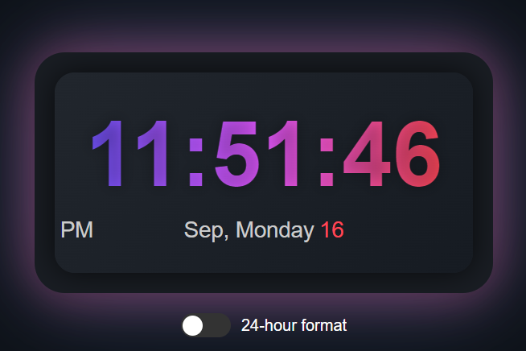
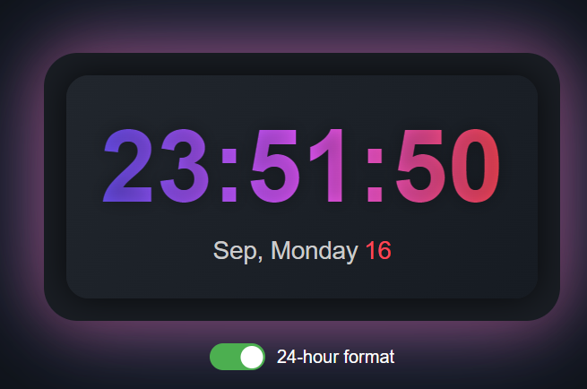

# Digital Clock Project

This project is a simple digital clock built with **JavaScript**, **HTML**, and **CSS**. It features both 12-hour and 24-hour formats with a date display and a toggle to switch between the two formats. The clock updates dynamically and displays the time, day, and date accurately.

## Table of Contents
- [ScreenShot](#screenshot)
- [Features](#features)
- [Built With](#built-with)
- [Prerequisites](#prerequisites)
- [Usage](#usage)
- [Contact](#contact)

## ScreenShots




<p align="right">(<a href="#table-of-contents">back to top</a>)</p>

## Features

- Dynamic time display with seconds.
- 12-hour and 24-hour formats toggle.
- Date display with day, month, and current date.
- User-friendly toggle for switching formats.
- Responsive design with a modern, sleek interface.

<p align="right">(<a href="#table-of-contents">back to top</a>)</p>

## Built With

This project was built using the following technologies:

* 
* 
* 

<p align="right">(<a href="#table-of-contents">back to top</a>)</p>

## Prerequisites

To run this project, all you need is a modern web browser that supports HTML, CSS, and JavaScript. There are no additional libraries or dependencies required.

<p align="right">(<a href="#table-of-contents">back to top</a>)</p>

## Usage

1. Clone the project from GitHub or download the files:
   ```bash
   git clone https://github.com/AmirrezaAhmadi/DigitalClock-App.git
   
2. Open the DigitalClock.html file in your browser.

<p align="right">(<a href="#table-of-contents">back to top</a>)</p>

## Contact

You can reach me through the following:

* Email: AmirrezaAhmadi.GH@Gmail.com
* Telegram: https://t.me/AmirrezaDevelop
* Instagram: https://www.instagram.com/codewithamirreza
* Project Link: https://github.com/AmirrezaAhmadi/DigitalClock-App.git

<p align="right">(<a href="#table-of-contents">back to top</a>)</p>
